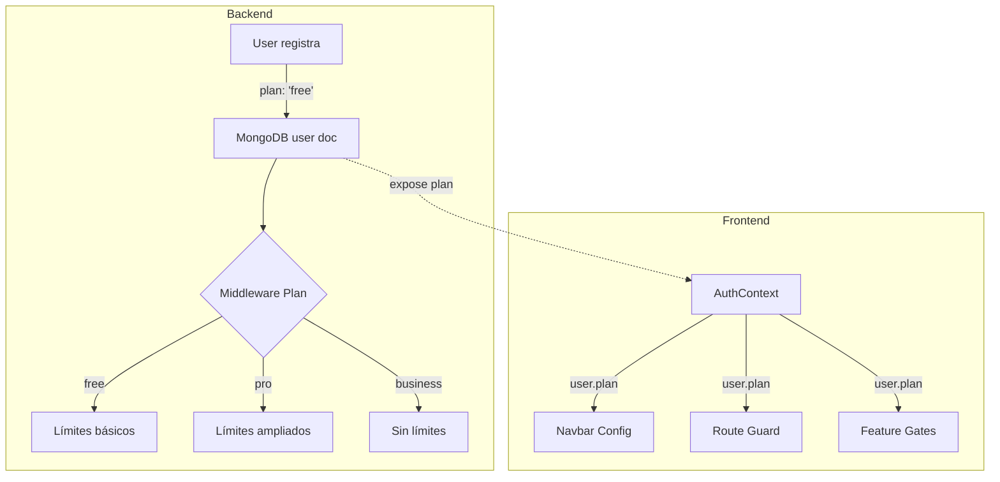
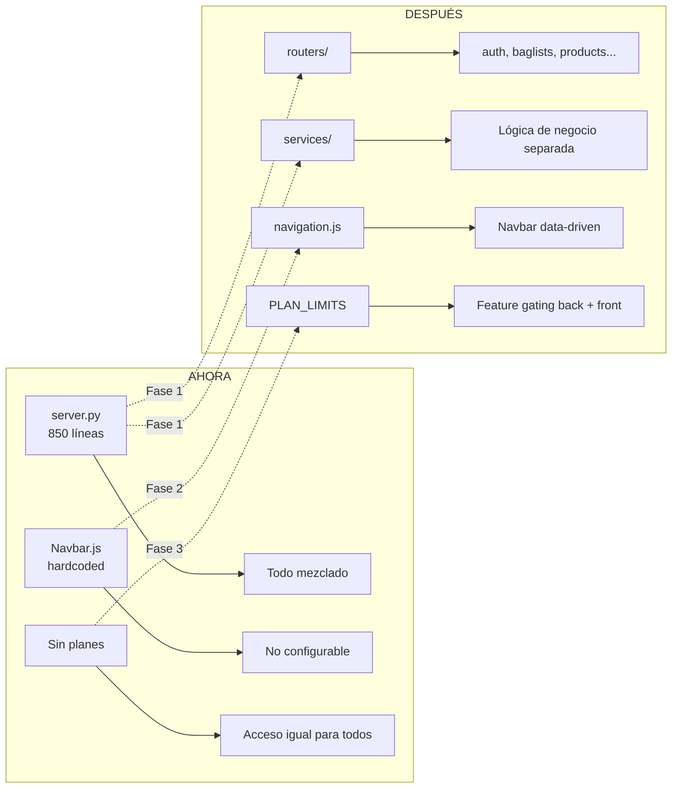

# 🔬 Análisis Técnico — Liser v26

## Estado Actual del Proyecto

| Aspecto | Estado | Problema |
|---------|--------|----------|
| Backend | **1 archivo** (`server.py` — 850 líneas) | Monolito, difícil de mantener |
| Navbar | **Hardcoded** | Cada cambio = editar JSX manualmente |
| Planes/Acceso | **No existe** | Todos los usuarios tienen acceso a todo |
| Auth Context | **1 archivo** | Mezcla auth + theme + API config |
| Modelos Pydantic | **En el mismo server.py** | No reutilizables |
| Migraciones | **1 script ad-hoc** | No hay sistema formal |

---

## 1. 🏗️ Modularización del Backend

### Problema
Todo el backend vive en [server.py](file:///d:/Excusas%20Automaticas/Liser_v26/backend/server.py) — 850 líneas con modelos, autenticación, rutas de baglists, productos, favoritos, analytics, uploads, y configuración mezclados.

### Estructura Propuesta

```
backend/
├── app/
│   ├── __init__.py            # create_app() factory
│   ├── config.py              # Settings con pydantic-settings
│   ├── database.py            # Conexión MongoDB, get_db()
│   ├── dependencies.py        # get_current_user, get_required_user, etc.
│   │
│   ├── models/
│   │   ├── __init__.py
│   │   ├── user.py            # UserRegister, UserLogin, UserOut
│   │   ├── baglist.py         # BagListCreate, BagListUpdate, BagListOut
│   │   ├── product.py         # ProductCreate, ProductOut, CustomField, SocialLink
│   │   └── analytics.py       # Modelos de respuesta de analytics
│   │
│   ├── routers/
│   │   ├── __init__.py
│   │   ├── auth.py            # /api/auth/*
│   │   ├── baglists.py        # /api/baglists/*
│   │   ├── products.py        # /api/baglists/{id}/products/*
│   │   ├── favorites.py       # /api/baglists/{id}/favorite, /api/baglists/{id}/save
│   │   ├── users.py           # /api/users/*
│   │   ├── analytics.py       # /api/*/analytics
│   │   └── upload.py          # /api/upload/*
│   │
│   ├── services/              # ← Lógica de negocio (NUEVO)
│   │   ├── auth_service.py    # hash_password, verify_password, create_token
│   │   ├── baglist_service.py # create, update, delete, search
│   │   ├── analytics_service.py
│   │   └── upload_service.py
│   │
│   └── utils/
│       ├── slugify.py
│       └── pagination.py
│
├── migrations/                # Migraciones versionadas
│   ├── 001_add_discount_codes.py
│   └── 002_add_plans.py
│
├── .env
├── main.py                    # uvicorn entrypoint
└── requirements.txt
```

### Ejemplo: `app/config.py`

```python
from pydantic_settings import BaseSettings

class Settings(BaseSettings):
    MONGO_URL: str
    DB_NAME: str = "liser_db"
    JWT_SECRET: str
    JWT_EXPIRATION_DAYS: int = 7
    CLOUDINARY_CLOUD_NAME: str
    CLOUDINARY_API_KEY: str
    CLOUDINARY_API_SECRET: str
    CORS_ORIGINS: str = "http://localhost:3000"
    
    # Límites por plan
    FREE_MAX_BAGLISTS: int = 5
    FREE_MAX_PRODUCTS_PER_LIST: int = 20
    PRO_MAX_BAGLISTS: int = 50
    PRO_MAX_PRODUCTS_PER_LIST: int = 100
    
    class Config:
        env_file = ".env"

settings = Settings()
```

### Ejemplo: `app/routers/auth.py`

```python
from fastapi import APIRouter, Request, Depends
from app.models.user import UserRegister, UserLogin
from app.services.auth_service import AuthService
from app.dependencies import get_required_user
from slowapi import Limiter

router = APIRouter(prefix="/api/auth", tags=["auth"])

@router.post("/register")
@limiter.limit("3/minute")
async def register(request: Request, data: UserRegister):
    return await AuthService.register(data)

@router.post("/login")
@limiter.limit("5/minute")
async def login(request: Request, data: UserLogin):
    return await AuthService.login(data)

@router.get("/me")
async def get_me(user=Depends(get_required_user)):
    return await AuthService.get_profile(user["id"])
```

### Ejemplo: `app/services/baglist_service.py`

```python
from app.database import get_db
from app.models.baglist import BagListCreate
from app.utils.slugify import slugify, generate_unique_slug
from datetime import datetime, timezone
import uuid

class BagListService:
    @staticmethod
    async def create(data: BagListCreate, user: dict) -> dict:
        db = get_db()
        
        # Verificar límites del plan
        count = await db.baglists.count_documents({"user_id": user["id"]})
        plan = user.get("plan", "free")
        max_lists = PLAN_LIMITS[plan]["max_baglists"]
        if count >= max_lists:
            raise HTTPException(
                status_code=403,
                detail=f"Plan {plan}: máximo {max_lists} BagLists"
            )
        
        baglist_id = str(uuid.uuid4())
        base_slug = slugify(data.title)
        unique_slug = await generate_unique_slug(db, base_slug)
        
        doc = {
            "id": baglist_id,
            "user_id": user["id"],
            "title": data.title,
            # ... resto de campos
        }
        await db.baglists.insert_one(doc)
        return doc
```

> [!IMPORTANT]
> La clave es la **capa de servicios**. Ahora mismo la lógica de negocio (verificar propiedad, contar documentos, montar respuestas) está dentro de los endpoints. Moverla a servicios permite reutilizarla y testearla independientemente.

---

## 2. 🧭 Navbar Configurable

### Problema Actual
Los ítems del navbar están **hardcodeados en JSX** en [Navbar.js](file:///d:/Excusas%20Automaticas/Liser_v26/frontend/src/components/Navbar.js). Cada cambio requiere editar el componente directamente, duplicar lógica entre desktop y móvil, y no hay forma de filtrar ítems por plan de usuario.

### Solución: Navbar Data-Driven

```javascript
// src/config/navigation.js

import { Compass, LayoutDashboard, Bookmark, BarChart2, Plus } from 'lucide-react';

export const NAV_ITEMS = [
  {
    key: 'explore',
    label: 'Explorar',
    path: '/explore',
    icon: Compass,
    requiresAuth: false,    // visible para todos
    minPlan: null,           // sin restricción de plan
    position: 'main',        // 'main' | 'action' | 'menu'
    showMobile: true,
  },
  {
    key: 'dashboard',
    label: 'Mis BagLists',
    path: '/dashboard',
    icon: LayoutDashboard,
    requiresAuth: true,
    minPlan: null,
    position: 'main',
    showMobile: true,
  },
  {
    key: 'saved',
    label: 'Guardados',
    path: '/saved',
    icon: Bookmark,
    requiresAuth: true,
    minPlan: null,
    position: 'main',
    showMobile: true,
  },
  {
    key: 'analytics',
    label: 'Analíticas',
    path: '/analytics',
    icon: BarChart2,
    requiresAuth: true,
    minPlan: 'pro',          // ← solo plan pro o superior
    position: 'main',
    showMobile: true,
  },
  {
    key: 'create',
    label: 'Nueva BagList',
    path: '/create',
    icon: Plus,
    requiresAuth: true,
    minPlan: null,
    position: 'action',     // botón CTA separado
    showMobile: true,
  },
];

// Niveles de plan ordenados de menor a mayor
export const PLAN_HIERARCHY = ['free', 'pro', 'business'];

export function canAccessFeature(userPlan, requiredPlan) {
  if (!requiredPlan) return true;
  const userLevel = PLAN_HIERARCHY.indexOf(userPlan || 'free');
  const requiredLevel = PLAN_HIERARCHY.indexOf(requiredPlan);
  return userLevel >= requiredLevel;
}
```

### Navbar Refactorizado

```jsx
// src/components/Navbar.js (simplificado)

import { NAV_ITEMS, canAccessFeature } from '@/config/navigation';

export function Navbar() {
  const { user } = useAuth();
  const userPlan = user?.plan || 'free';

  // Filtrar ítems según auth y plan
  const visibleItems = NAV_ITEMS.filter(item => {
    if (item.requiresAuth && !user) return false;
    if (!canAccessFeature(userPlan, item.minPlan)) return false;
    return true;
  });

  const mainItems = visibleItems.filter(i => i.position === 'main');
  const actionItems = visibleItems.filter(i => i.position === 'action');
  const mobileItems = visibleItems.filter(i => i.showMobile);

  return (
    <>
      <nav>
        {/* Desktop: renderizar mainItems dinámicamente */}
        <div className="hidden md:flex items-center gap-1">
          {mainItems.map(item => (
            <Link key={item.key} to={item.path}>
              <Button variant={isActive(item.path) ? 'secondary' : 'ghost'} size="sm" className="gap-2">
                <item.icon className="w-4 h-4" /> {item.label}
              </Button>
            </Link>
          ))}
        </div>
        {/* Action buttons */}
        {actionItems.map(item => (
          <Link key={item.key} to={item.path}>
            <Button size="sm" className="gap-2 bg-primary">
              <item.icon className="w-4 h-4" /> {item.label}
            </Button>
          </Link>
        ))}
      </nav>

      {/* Mobile: mismo array, misma lógica */}
      <div className="md:hidden fixed bottom-0 ...">
        {mobileItems.map(item => (
          <Link key={item.key} to={item.path} className={...}>
            <item.icon className="w-5 h-5" />
            <span className="text-xs">{item.label}</span>
          </Link>
        ))}
      </div>
    </>
  );
}
```

> [!TIP]
> Con esta estructura, añadir un nuevo enlace al navbar = **añadir un objeto al array** `NAV_ITEMS`. No hace falta tocar el componente.

---

## 3. 🔐 Sistema de Planes y Control de Acceso

### Estado Actual
No existe ningún concepto de "plan" en el proyecto. Todos los usuarios tienen acceso idéntico a todas las funcionalidades.

### Arquitectura Propuesta



### Backend: Modelo de Plan

```python
# app/models/plan.py

PLAN_LIMITS = {
    "free": {
        "max_baglists": 5,
        "max_products_per_list": 20,
        "analytics": False,         # sin acceso a analíticas
        "custom_fields": False,     # sin campos personalizados
        "social_links": False,      # sin redes sociales en productos
        "private_lists": False,     # todas públicas
        "image_upload": True,       # upload básico
        "max_image_size_mb": 2,
    },
    "pro": {
        "max_baglists": 50,
        "max_products_per_list": 100,
        "analytics": True,
        "custom_fields": True,
        "social_links": True,
        "private_lists": True,
        "image_upload": True,
        "max_image_size_mb": 5,
    },
    "business": {
        "max_baglists": -1,        # ilimitado
        "max_products_per_list": -1,
        "analytics": True,
        "custom_fields": True,
        "social_links": True,
        "private_lists": True,
        "image_upload": True,
        "max_image_size_mb": 10,
    },
}
```

### Backend: Dependency de Plan

```python
# app/dependencies.py

from fastapi import HTTPException, Depends
from app.models.plan import PLAN_LIMITS

async def get_user_plan(user=Depends(get_required_user)):
    """Devuelve el usuario con su plan y límites resueltos."""
    plan_name = user.get("plan", "free")
    limits = PLAN_LIMITS.get(plan_name, PLAN_LIMITS["free"])
    return {**user, "plan": plan_name, "limits": limits}

def require_feature(feature: str):
    """Dependency factory para gating de features."""
    async def _check(user=Depends(get_user_plan)):
        if not user["limits"].get(feature, False):
            raise HTTPException(
                status_code=403, 
                detail=f"Tu plan ({user['plan']}) no incluye '{feature}'. Mejora tu plan."
            )
        return user
    return _check
```

### Uso en Endpoints

```python
# Endpoint que requiere plan pro para analytics
@router.get("/baglists/{baglist_id}/analytics")
async def get_analytics(
    baglist_id: str,
    user=Depends(require_feature("analytics"))  # ← gating automático
):
    ...

# Endpoint que verifica límites de cantidad
@router.post("/baglists")
async def create_baglist(
    data: BagListCreate,
    user=Depends(get_user_plan)
):
    count = await db.baglists.count_documents({"user_id": user["id"]})
    max_allowed = user["limits"]["max_baglists"]
    if max_allowed != -1 and count >= max_allowed:
        raise HTTPException(
            status_code=403,
            detail=f"Has alcanzado el límite de {max_allowed} listas en tu plan {user['plan']}"
        )
    ...
```

### Frontend: Feature Gate Component

```jsx
// src/components/FeatureGate.js

import { useAuth } from '@/context/AuthContext';
import { canAccessFeature } from '@/config/navigation';

export function FeatureGate({ feature, fallback = null, children }) {
  const { user } = useAuth();
  const userPlan = user?.plan || 'free';

  // Mapeo feature → plan mínimo requerido
  const FEATURE_PLANS = {
    analytics: 'pro',
    custom_fields: 'pro',
    social_links: 'pro',
    private_lists: 'pro',
    unlimited_lists: 'business',
  };

  const requiredPlan = FEATURE_PLANS[feature];
  
  if (!canAccessFeature(userPlan, requiredPlan)) {
    return fallback || (
      <div className="text-center py-8 border border-dashed border-primary/30 rounded-xl bg-primary/5">
        <p className="text-muted-foreground">
          Esta función está disponible en el plan <strong>{requiredPlan}</strong>.
        </p>
        <Button className="mt-3">Mejorar Plan</Button>
      </div>
    );
  }

  return children;
}
```

### Frontend: Route Protection por Plan

```jsx
// En App.js
function PlanRoute({ minPlan, children }) {
  const { user, loading } = useAuth();
  if (loading) return null;
  if (!user) return <Navigate to="/auth" />;
  if (!canAccessFeature(user.plan, minPlan)) {
    return <Navigate to="/upgrade" />;
  }
  return children;
}

// Uso:
<Route path="/analytics" element={
  <PlanRoute minPlan="pro">
    <AnalyticsPage />
  </PlanRoute>
} />
```

---

## 4. 🔧 Otras Mejoras Técnicas

### 4.1 Separar AuthContext

Actualmente [AuthContext.js](file:///d:/Excusas%20Automaticas/Liser_v26/frontend/src/context/AuthContext.js) mezcla autenticación con gestión de tema. Debería separarse:

```
context/
├── AuthContext.js      # Solo auth: user, token, login, logout, register
├── ThemeContext.js      # Solo tema: theme, toggleTheme
└── PlanContext.js       # Derivado: plan del usuario, feature gates
```

### 4.2 Capa API centralizada en el Frontend

Actualmente cada página hace `axios.get/post` directamente con headers manuales. Debería existir un cliente API:

```javascript
// src/lib/api.js

import axios from 'axios';

const api = axios.create({
  baseURL: `${process.env.REACT_APP_BACKEND_URL}/api`,
});

// Interceptor que inyecta el token automáticamente
api.interceptors.request.use((config) => {
  const token = localStorage.getItem('liser_token');
  if (token) config.headers.Authorization = `Bearer ${token}`;
  return config;
});

// Interceptor para manejar 401 globalmente
api.interceptors.response.use(
  (res) => res,
  (err) => {
    if (err.response?.status === 401) {
      localStorage.removeItem('liser_token');
      window.location.href = '/auth';
    }
    return Promise.reject(err);
  }
);

// Funciones tipadas
export const authAPI = {
  login: (data) => api.post('/auth/login', data),
  register: (data) => api.post('/auth/register', data),
  getMe: () => api.get('/auth/me'),
};

export const baglistAPI = {
  getAll: (params) => api.get('/baglists', { params }),
  getMine: () => api.get('/baglists/my'),
  getById: (id) => api.get(`/baglists/${id}`),
  create: (data) => api.post('/baglists', data),
  update: (id, data) => api.put(`/baglists/${id}`, data),
  delete: (id) => api.delete(`/baglists/${id}`),
};

export const analyticsAPI = {
  getUserAnalytics: () => api.get('/users/me/analytics'),
  getBaglistAnalytics: (id) => api.get(`/baglists/${id}/analytics`),
};

export default api;
```

> [!TIP]
> Con esto, en las páginas simplemente haces `baglistAPI.getMine()` sin preocuparte de headers ni base URL. Y si cambian los endpoints, solo se edita un archivo.

### 4.3 Problemas de Seguridad Actuales

| Problema | Ubicación | Impacto |
|----------|-----------|---------|
| `update_me` acepta `dict` sin validar | [server.py:L277](file:///d:/Excusas%20Automaticas/Liser_v26/backend/server.py#L277) | Un usuario podría enviar keys arbitrarios |
| `duplicate_product` acepta `dict` genérico | [server.py:L522](file:///d:/Excusas%20Automaticas/Liser_v26/backend/server.py#L522) | Falta validación con Pydantic model |
| Click endpoints sin rate limiting | [server.py:L691-L719](file:///d:/Excusas%20Automaticas/Liser_v26/backend/server.py#L691-L719) | Abuso de métricas de analytics |
| No hay validación de URLs en `image_url` y `link` | [server.py:L85-L88](file:///d:/Excusas%20Automaticas/Liser_v26/backend/server.py#L85-L88) | Se podrían inyectar URLs maliciosos |
| `to_list(10000)` en sitemap | [server.py:L657](file:///d:/Excusas%20Automaticas/Liser_v26/backend/server.py#L657) | Sin paginación, riesgo de OOM con crecimiento |

### 4.4 MongoDB: Productos Embebidos vs Colección Separada

Actualmente los productos están embebidos dentro del documento de `baglists`. Esto funciona bien para pocas listas con pocos productos, pero:

- Actualizar 1 producto = reescribir todo el array `products`
- Si un baglist tiene 100+ productos, el documento se vuelve pesado
- No se pueden hacer queries directas sobre productos

**Recomendación**: Para el volumen actual, los productos embebidos están bien. Pero si llegas a >50 productos por lista, considerar moverlos a una colección separada con referencia al `baglist_id`.

### 4.5 Categorías Duplicadas

Las categorías están definidas **tanto en el backend** (`server.py:L47`) como **hardcodeadas en el frontend** (`ExplorePage.js:L13`). Si añades una categoría en el backend, el frontend no la mostrará en los filtros.

**Solución**: El frontend ya llama `/api/categories`. Usar esa llamada también en `ExplorePage` en lugar del array hardcodeado.

---

## 5. 📋 Plan de Migración por Fases

### Fase 1: Modularizar Backend (menor riesgo)
1. Crear la carpeta `app/` con la estructura propuesta
2. Mover modelos a `app/models/`
3. Mover rutas a `app/routers/` (un router por dominio)
4. Extraer servicios a `app/services/`
5. Crear `app/config.py` con `pydantic-settings`
6. Mantener `server.py` como importador hasta que todo funcione
7. **Tests**: ejecutar suite existente para verificar que nada se rompe

### Fase 2: Frontend — API Layer + Navbar Config
1. Crear `src/lib/api.js` con el cliente centralizado
2. Migrar las páginas una por una para usar el nuevo API client
3. Crear `src/config/navigation.js`
4. Refactorizar `Navbar.js` para ser data-driven
5. Separar `AuthContext` en auth + theme

### Fase 3: Sistema de Planes
1. Añadir campo `plan` al modelo de usuario en MongoDB (`"free"` por defecto)
2. Crear migración para usuarios existentes
3. Implementar `PLAN_LIMITS` y el dependency `require_feature`
4. Crear `FeatureGate` component en frontend  
5. Añadir `PlanRoute` al router
6. Integrar Stripe / pasarela de pago (fase posterior)

### Fase 4: Polish
1. Fix de seguridad (Pydantic models en todos los endpoints)
2. Rate limiting en endpoints de clicks
3. Paginación en sitemap
4. Cacheo de categorías y datos estáticos

---

## Resumen Visual


